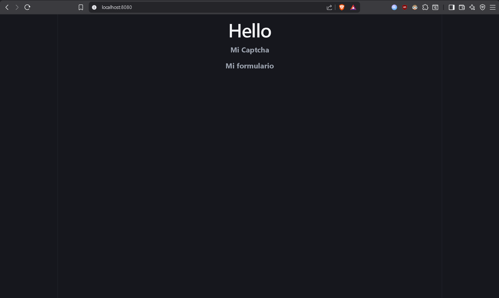
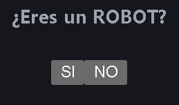

# REACT CODIGO

## Creacion de un FORM y envio de datos a BACKEND

Pasemos a la practica

Primero, repasemos algunos conceptos que usaremos para nuestro ejemplo de manera rapida

| Termino | Definicion |
| - | - |
| Componente | Funciones de REACT, estas retornan JSX |
| JSX | HTML de JAVASCRIPT |
| props | Componentes como funciones |
| useState | Funcion util para cambiar una variable en un JSX |
| useEffect | Funcion que ejecuta codigo |
| Axios | Libreria que nos permite enviar datos a BackEnd |

Ahora si, pasemos al ejemplo

---

**Contexto**: Realizar una pagina WEB simple que cumpla con las siguientes condiciones:

- Tener un ReCAPTCHA que pregunte directamente a la persona si es un ROBOT, marcando SI o NO
- Si pasa el ReCAPTCHA, le saldra un formulario preguntando su Nombre y Edad
- Finalmente, envia estos datos usando AXIOS al futuro BACKEND

### Comunicacion entre Componentes

Como se ha dicho con anterioridad, los Componentes en palabras simples, no son mas que funciones que retornan JSX (basicamente HTML), como se muestre en el ejemplo:

```js
function Componente(){
    return <h1> JSX </h1>
}
```

Por ende, podemos pensar en estos componentes como los contenedores que se mostraran durante la pagina.

Los dividiremos en 3 archivos:

- App(): Componente **principal** que contendra a los demas Componentes
- ReCAPTCHA(): Componente que contendra la consulta del ReCAPTCHA
- Form(): Formulario que recibira el ingreso de datos del usuario y su posterior a BACKEND

Y para ser ordenados los ordenaremos de la siguiente manera (En nuestra area de trabajo):

    Practica
        ├─── App.jsx
        │
        └─── Componentes
                ├──── Form.jsx
                ├──── ReCAPTCHA.jsx

Una vez ordenados, podemos comenzar a generar su esqueleto base

**Form**
```js
function Form(){
    return <h1> Mi Formulario </h1> //JSX por retornar
}

export default Form //Funcion principal del archivo
```

Al usar ``export default Form``, le estamos diciendo a REACT que la funcion llamada "Form" sera la funcion que exportara el codigo HTML que querramos usar.

De esta manera aplicamos la misma logica a ReCAPTCHA

**ReCAPTCHA**
```js
function ReCAPTCHA(){
    return <h1> Mi Captcha </h1> //JSX por retornar
}

export default ReCAPTCHA
```

Ahora bien, con ambos archivos creados, necesitamos crear nuestro archivo principal, en este caso "App", como a su vez, importar y utilizar los componentes Form y ReCAPTCHA

```js
//Importar los otros componentes
import Form from "./Componentes/Form"
import ReCAPTCHA from "./Componentes/ReCAPTCHA"

function App(){
    //Construir la pagina
    return (
        <div>
            <ReCAPTCHA/> //Componete ReCAPTCHA
            <Form/> //Componente Form
        </div>
    )
}

export default App //JSX por retornar
```

Aqui hay algunas cosas que considerar:

**[1]** Todos los componentes deben retornar un solo JSX.

Como se ve en esta parte del codigo

```js
return (
        <div>
            <ReCAPTCHA/> //Componete ReCAPTCHA
            <Form/> //Componente Form
        </div>
    )
```

Estamos retornando un "<div>", esto es importante porque, como la mayoria de funciones, **unicamente podemos retornar un valor**... Y si queremos crear un JSX con varios otros componentes, debemos guardarlos en un **contenedor**...

De otra manera, la funcion no sabria que retornar y nos daria error

```js
//ERROR!!!
return (
        <ReCAPTCHA/> //Componete ReCAPTCHA
        <Form/> //Componente Form
    )
```

**[2]** Exportar App

¿A donde va nuestro componente App cuando ejecutamos... `export default App` ?

Facil, este va al archivo "**main.jsx**"... Si ejecutamos correctamente la construccion de REACT al momento en la instalacion, dentro de nuestra carpeta raiz nos deberia de aparecer el archivo mencionado

Este archivo se encarga de desplegar la pagina web creada, y **NO debe modificarse a menos de ser necesario**

Por lo general, suele tener este contenido en donde por ya dicho, desplega nuestro archivo App.

```js
import { StrictMode } from 'react'
import { createRoot } from 'react-dom/client'
import './index.css'
import App from './Practica/App'

createRoot(document.getElementById('root')).render(
  <StrictMode>
    <App />
  </StrictMode>,
)
```

Con todo esto hecho, deberiamos tener algo similar a lo siguiente:



---

### Ocultar COMPONENTES con "useState"

Digamos que queremos que nuestra intefaz sea algo interactiva. Cuando se completa el ReCATPCHA, este se **oculta** y muestra el formulario previamente oculto.

Para ello, vamos a hacer un truco con la funcion "**useState**". Que si recordamos, es una funcion de REACT que sirve para cambiar los datos de algun contenedor

Para esto seguiremos los siguientes pasos:

---

**[1]** Crear variables con useState

**useState** por defecto, retorna un arreglo con 2 valores:

- Una **variable**, que tiene como valor inicial, un dato que nosotros le pasamos
- Y Una funcion, que sirve para cambiar el valor de la **variable** cuando queramos

La importamos a nuestro codigo:

```js
import { useState } from 'react';
```

Y para nuestro ejemplo, la crearemos de esta forma

```js
const [isVisible, setShow] = useState(true);
```

Siendo:

- **isVisible**: La variable, teniendo como valor inicial un booleano de tipo "true"
- **setShow**: La funcion, que nos servira para cambiar el valor de **isVisible**

Ahora, cuando queramos cambiar la variable de isVisible, podemos usar por ejemplo: `setShow(false)`

---

**[2]** JSX como variable

Recordemos que un JSX es **HTML que puede ser tratado como variable en JavaScript**, por ende, para aplicar este truco podemos convertirla a una variable, de esta manera ordenando de mejor manera nuestra funcion

Por lo tanto nuestro codigo quedaria así:

```js
import { useState } from "react";

function ReCAPTCHA( ){

    //Uso de useState
    const [isVisible, setShow] = useState(true);
    
    //HTML en variable
    const jsx = <h3> Mi captcha </h3>

    return jsx;
}

export default ReCAPTCHA
```

Y para nuestro caso, al ser un ReCAPTCHA extremadamente simple, le agregamos el contenido que queremos que aparezca:

```js
const jsx = (
        <div >
            <h3> Mi CAPCTHA</h3> 
            <h4> ¿Eres un ROBOT? </h4>
            
            <button>
                SI
            </button>

            <button onClick={() => console.log("Ocultar JSX") }>
                NO
            </button>

        </div>
    )
```

Mostrandonos este resultado:



Siendo que, al darle CLICK al boton "NO", le agregaremos la logica necesaria para el paso del punto clave

---

**[3]** Punto clave

Para terminar, necesitamos ejecutar el **punto clave**, que es lo que hara que nuestro JSX pueda desaparacer.

Es simple, vamos a aprovechar la variable "**isVisible**" para que decida si retornar el JSX o no retornar nada.

```js
import { useState } from "react";

function ReCAPTCHA( ){

    const [isVisible, setShow] = useState(true);
    
    const jsx = (
        <div >
            <h3> Mi CAPCTHA</h3>
            <h4> ¿Eres un ROBOT? </h4>

            <button>
                SI
            </button>
            
            <button  onClick={() => setShow(false)}>
                NO
            </button>

        </div>
    )

    return isVisible && jsx;
}

export default ReCAPTCHA
```

**¿Que hace el codigo?**

si **isVisible** es TRUE: Entonces retornara el contenedor sin problemas
si **isVisible** es FALSE: Entonces NO retornara el contenedor.

esto dado por la linea: ``return isVisible && jsx``

Este valor de isVisible, como ya hemos dicho con anterioridad, es posible modificarlo con la funcion **"setShow()"**, la cual hemos insertado en la logica de button. De esta manera cuando el usuario da CLICK en el boton "NO", "isVisible" pasara a ser FALSE, dejando a `return isVisible && jsx` sin poder retornar nada.


### 


| Concepto | Ejemplo               |
| -------- | --------------------- |
| URL      | dirección de la casa  |
| POST     | tipo de envío         |
| JSON     | contenido de la carta |
