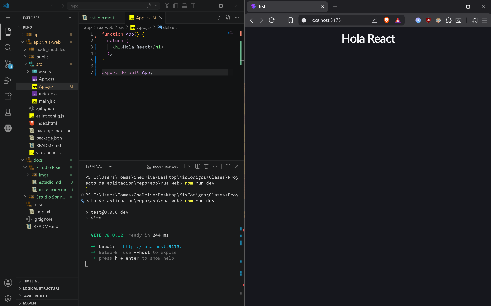

# React

REACT es una libreria de JAVASCRIPT especializada en interfaces graficas.

## Inicio

Primero lo primero, el archivo principal y base de todo sera:

        src/App.jsx

Ahí normalmente comienzas a programar la interfaz.

--- 

En un principio este archivo vendra lleno de codigo de ejemplo, sin embargo si queremos comenzar a programar nuestra GUI, podemos borrarlo por completo y en este caso cambiarlo por algo mas simple:

```js
function App() {
  return (
    <h1>Hola React</h1>
  );
}

export default App;
```

**IMPORTANTE**: Lo util de usar **npm**, es que podemos ver la actualizacion de nuestro codigo en tiempo real siempre y cuando se este ejecutando en la terminal, como se ve en el ejemplo



## Conceptos y librerias externas

React en el fondo **funciona muy similar que JavaScript**, solo que este aprovecha de manera distina los recursos como html y la logica en general

### Componente

Un componente podemos verlos como funciones que unicamente **retornan JSX** (Que es HTML pero en JavaScript), como se ve en el ejemplo:

```js
//Componente
function Saludo() {
  return <h1>Hola</h1>;
}
```

### JSX

Es **HTML dentro de JavaScript**, estos pueden usar variables y suelen ser retornados por los **Componentes**

```js
//Componente
function Saludo() {
    const nombre = "Tomas";
    return <h1>Hola {nombre}</h1>;
}
```

### Props

Son los datos que un Componente puede recibir de otro componente, se pasan argumentos y sirven como una especie muy extraña de funciones.

```js
//Argumento "props"
function SaludarPersona(props) {
  return <h1>Hola {props.nombre}</h1>;
}

function App(){
    //Usar prop y pasarle parametro "Tomas"
    return <SaludarPersona nombre="Tomas"/>
}
```

### useState

"useState" sirve para **cambiar datos que se encuentren dentro de un contenedor o Componente**

Extra: useState es un "HOOK", Un Hook en React es una función especial que permite usar características de React dentro de componentes funcionales.

En este ejemplo, al dar CLICK en el boton, el texto de <p> pasa a ser de "Hola" a "Chao"

```js
//Importar HOOK
import { useState } from "react";

function Mensaje() {
  const [texto, setTexto] = useState("Hola");

  return (
    <div>
      <p>{texto}</p>

      <button onClick={() => setTexto("Chao")}>
        Cambiar
      </button>
    </div>
  );
}
```

### useEffect

"useEffect" es un HOOK que unicamente sirve para ejecutar codigo cuando ocurra algo, es asi de sencillo

En este ejemplo, se ejecuta **una sola vez** (por el "[]") cuando el componente se renderiza

```js
import { useEffect } from "react";

function App() {

    //Ejecutar codigo
    useEffect(() => {
        console.log("Codigo ejecutado");
    }, []); //El "[]" sirve para ejecutarlo una sola vez
    

  return <h1>Hola</h1>;
}
```

### **Axios** (IMPORTANTE)

Axios es una libreria externa que facilita el proceso de hacer solicitudes HTTP, **es decir, permite comunicarse con APIs como SPRING BOOT**

Sin Axios, se tendria que usar el metodo fetch, que es nativo de JavaScript.

```js
fetch("https://jsonplaceholder.typicode.com/users/1")
  .then(respuesta => respuesta.json())
  .then(data => {
    console.log(data);
  });
```

Sin embargo, con Axios, el proceso se facilita

```js
async function obtenerUsuario() {
  const respuesta = await fetch(
    "https://jsonplaceholder.typicode.com/users/1"
  );

  const data = await respuesta.json();

  console.log(data);
}
```

Por lo general, son ejecutados con el metodo de **useEffect()**

### React Router

React Router es una libreria de npm que nos permite tener mutiples paginas

```js
import {
  BrowserRouter,
  Routes,
  Route
} from "react-router-dom";
```

## Codigo de ejemplo

```js
//IMPORTACIONES
import { useState, useEffect } from "react";
import axios from "axios";

//COMPONENTE
function App() {

  //ESTADOS
  const [contador, setContador] = useState(0);
  const [nombre, setNombre] = useState("");
  const [mensajeApi, setMensajeApi] = useState("");

  //SE EJECUTA UNA VEZ
  useEffect(() => {

    console.log("Aplicacion iniciada");

    //PETICION HTTP
    axios
      .get("https://jsonplaceholder.typicode.com/users/1")
      .then((respuesta) => {

        //GUARDAR RESPUESTA
        setMensajeApi(respuesta.data.name);

      })
      .catch((error) => {
        console.log(error);
      });

  }, []);

  //FUNCION
  function saludar() {
    alert(`Hola ${nombre}`);
  }

  //JSX
  return (
    <div>

      <h1>React Demo</h1>

      <hr />

      {/* useState */}
      <h2>Contador</h2>

      <p>{contador}</p>

      <button onClick={() => setContador(contador + 1)}>
        Sumar
      </button>

      <button onClick={() => setContador(contador - 1)}>
        Restar
      </button>

      <hr />

      {/* Formularios */}
      <h2>Formulario</h2>

      <input
        type="text"
        placeholder="Escribe tu nombre"
        value={nombre}
        onChange={(e) => setNombre(e.target.value)}
      />

      <button onClick={saludar}>
        Saludar
      </button>

      <p>Nombre actual: {nombre}</p>

      <hr />

      {/* API */}
      <h2>Axios / API</h2>

      <p>Usuario obtenido:</p>

      <h3>{mensajeApi}</h3>

    </div>
  );
}

export default App;
```