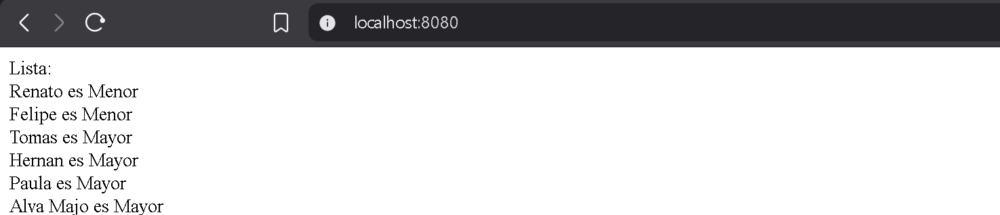

## Crea tu primer Controller

Ahora pasamos a la practica.

El flujo general de los controllers es el siguiente:

    Clase java -> Service -> Controller

Recordemos:

(Extra) **Clase JAVA**: Logica de si misma

**Service**: Logica del sistema en general

**Controller**: Despliega los SERVICES a la pagina WEB


- La Clase JAVA deberia tener solo logica de si misma
- Service deberia tener logica del Sistema General (APIS, BD, Listas, Etc), usando a su vez tambien clases JAVA
- Controller deberia **"instanciar a su manera"** a SERVICE y retornar en HTML (String) sus valores

Todo esto queda mas claro con un ejemplo.

## Ejemplo

### **Clase JAVA**

Digamos que recibimos una lista de usuarios de una BASE DE DATOS (Simulada), y nuestro objetivo es: Mostrar en pantalla si estos son adultos o no en una lista ordenada

Para esto, vamos a crear 3 carpetas:

    Classes/...
    Services/...
    Controllers/...

Donde

- En Clases: Iran las clases de JAVA donde ira la logica de los usuarios de manera individual
- En Services: Ira la logica de la creacion, proceso y ordenamiento de la lista de usuarios
- En Controllers: Desplegaremos los resultados en pantalla

Digamos que unicamente obtenemos 2 parametros de la base de datos, que son el **nombre** de cada usuario y la **edad** de estos mismos.

Entonces, para nuestra clase Usuario, deberia tener una estructura similar a la siguiente:

- name;
- age;
- isAdult();
- getName();
- getAge();

Con esto en mente, construimos el codigo de manera normal... Al ser una clase de JAVA no es necesario anotaciones ni nada extraño

Clase Usuario:

```java
public class Usuario {
    
    private String name;
    private int age;

    public Usuario(String name, int age){
        this.name = name;
        this.age = age;
    }
    
    public boolean isAdult(){
        return (this.age >= 18) ? true : false;
    }

    public String getName() {
        return name;
    }

    public int getAge() {
        return age;
    }
}
```

Como se puede ver, en cuanto a logica, unicamente procesamos informacion de la propia clase `isAdult()`... Luego no hay mucho mas.

--- 

Una vez con la clase de JAVA creada, deberiamos de pasar al SERVICE para crear su logica en el sistema, sin embargo para este ejemplo, vamos a pasar directamente al CONTROLLER para asi tener una vista mas amplia sobre el tema

### **CONTROLLER**

El CONTROLLER como hemos ya dicho, sirve para desplegar nuestros resultados en la WEB, por lo que para nuestro ejemplo de usuario debemos de preguntarnos varias cosas.

- ¿En que direccion de la pagina se desplegara esta informacion?
- ¿Que informacion debe ser desplegada?
- ¿Que SERVICES necesitamos para desplegar esta informacion?

Y con estas preguntas, podemos comenzar a estructurar nuestro CONTROLLER

- La direccion sera el inicio de la pagina
- La lista ordenada de los usuarios
- Necesitamos el SERVICE de los usuarios

Y asi podemos comenzar con el codigo:

```java
@RestController //FrontEnd y BackEnd iran separados, por ende necesitamos de un RESTController
@RequestMapping("/") //La direccion sera el inicio de la pagina
public class UsuarioController {

    //Instanciar clase SERVICE de manera correcta 
    private final UsuarioService us;
    public UsuarioController(UsuarioService us){
        this.us = us;
    }
    
    //GetMapping sirve para definir una subdireccion de la direccion dada por RequestMapping, como queremos que siga siendo el inicio de la pagina, no colocamos nada
    @GetMapping 
    public String render(){
        return us.renderList(); //Desplegar la lista ordenada de los usuarios, Spring Boot luego se encarga de traducir todo a HTML
    }
    
}
```

---

Explicacion:

**Instanciar clases SERVICE**

Como hemos dicho, instanciar clases en Spring Boot con "new Clase()" es una mala practica, es por eso que en el CONTROLLER no se hace de manera normal, si no... Que la clase "usuarioService" se define como **atributo privado**, para luego ser pasamo como **argumento en el constructor**, de esta manera, SPRING BOOT puede manejar la clase UsuarioService de una manera mas veloz y eficiente.

```java
//CORRECTO !!!
private final UsuarioService us;
public UsuarioController(UsuarioService us){
    this.us = us;
}

//INCORRECTO!!!
UsuarioService us = new UsuarioService();
```

**IMPORTANTE**: Esta practica NO se aplica a clases JAVA, si la clase es de tipo JAVA no hay problema con instanciarla de esta manera.

---

**GetMapping**

¿Como sabe SPRING BOOT con que metodo desplegar?... **Con GetMapping()**.

GetMapping() le sirve a SPRING BOOT, no solo como en que direccion debe ser desplegada la informacion, si no tambien como un endpoint HTTP, es decir, que informacion mostrar en la ruta seleccionada.

En nuestro ejemplo, el GetMapping esta vacio, lo que indica que la direccion debe ser la misma que la de RequestMapping

```java
@GetMapping 
public String render(){
    return us.renderList(); //Desplegar la lista ordenada de los usuarios
}
```

Sin embargo, si este tuviera una subdireccion, podriamos definir varios GetMapping que podrian desplegarse en distintas direcciones de la pagina WEB

```java
@GetMapping("usuarios/por_edad")
public String render(){
    return us.renderList(); //Desplegar la lista ordenada de los usuarios
}

@GetMapping("usuarios/nombres")
public String render(){
    return us.renderNames(); //Desplegar solo nombres 
}
```

Siendo asi, posible desplegar diversas informaciones dependiendo de la ruta.

| Direccion | Contenido |
| - | - |
| /usuarios/por_edad | Lista de usuarios indicando su nombre y si es adulto o menor |
| /usuarios/nombres | Lista de usuarios indicando unicamente su nombre |

---

### **SERVICE**

Y para finalizar, solo nos queda la logica del sistema en general, que con los conceptos ya aprendidos, es el menos complicado de entender, pues la logica para este mismo es controlado mayormente por la zona de confort de codigo normal tipo JAVA, aunque con las partes ya vistas de Spring Boot... Por lo menos para este ejemplo

Segun la informacion proporcionada + la estructura que hemos definido en Usuario y UsuarioController, es facil ver que debemos tener una estructura parecida a la siguiente

- bd : Base de datos **simulada** (Clase de tipo SERVICE) que nos entrega la lista
- sortList() : Metodo para ordenar la lista
- renderList() : Metodo final del SERVICE que entregara un STRING que sera desplegado como HTML

Por lo que construyendo el esqueleto del codigo, nos quedaria algo parecido a esto

```java
@Service //Anotacion indicando que es de tipo SERVICE
public class UsuarioService {

    //Instanciar clases de tipo SERVICE
    private BD_Service bd;
    public UsuarioService(BD_Service bd){
        this.bd = bd;
    }

    //Metodo para sortear lista
    public String sortList(List<Usuario> users) {
        //...
    }

    //Metodo final
    public String renderList(){
        List<Usuario> users = bd.getUsers();
        String result = sortList(users);
        return result;
    }
}
```

Y finalmente diseñando el metodo para ordenar los usuarios usando solo codigo JAVA

```java
public String sortList(List<Usuario> users) {
    String result = "Lista: <br>"; //Lenguaje HTML para dar saltos de linea
    //Diseño para ordenar con una Dequeue de Strings
    Deque<String> deque = new ArrayDeque<>();
    for (Usuario user : users) {
        if (user.isAdult()) {
            String aux = user.getName() + " es Mayor";
            deque.addLast(aux);
        } else {
            String aux = user.getName() +  " es Menor";
            deque.addFirst(aux);
        }
    }
    result += String.join("<br>", deque); //Para terminar, unimos en un solo String los Strings de Dequeue, colocando un salto de linea entre cada uno
    return result;
}
```

---

### Final

Si ejecutamos todo de manera correcta, nos deberia quedar un flujo parecido al siguiente

    Clase java (Usuario) -> Service (UsuarioService) -> Controller (UsuarioController)

Donde:

- Usuario: Proporciona solo logica basica del usuario
- UsuarioService: Recibe datos de la BD, ordena la lista de los usuarios y luego retorna el nuevo resultado al controlador
- UsuarioController: Despliega los datos en la pagina inicial de la WEB

Quedando lo siguiente:

