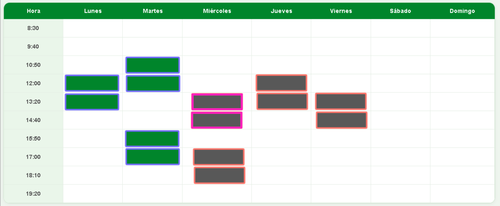
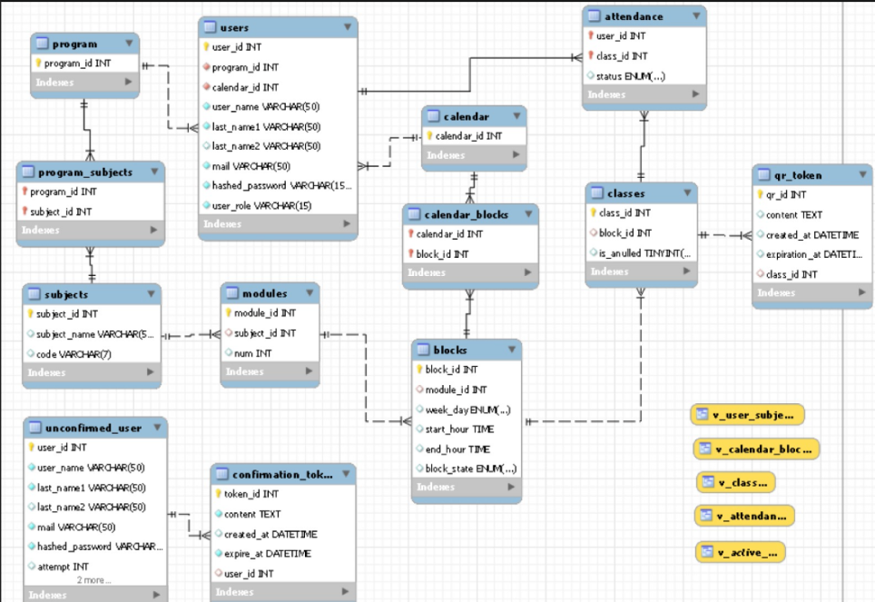
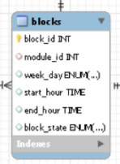

## A considerar
---
### Rua Config
El archivo ``RuaConfig.java`` es una clase estatica la cual contiene los siguientes atributos

`RuaConfig.java`:
```jsx
public static final String FRONTEND_URL = "http://localhost:1427";
public static final String BACKEND_URL = "http://localhost:1428";
```

- Usa **"BACKEND_URL"** mas la direccion relativa cada vez que quieras hacer algo relacionado a las URL's del BACKEND
- Usa **"FRONTEND_URL"** mas la direccion relativa del FRONTEND cada vez que desees recibir o enviar informacion referente al BACKEND.
### DTO's
Debes de entender y manejar apropiadamente los DTO's al menos a un nivel basico

# EJERCICIOS
## Ejercicio 1: Eliminación de un endpoint deprecado
---
En `AttendanceController.java` existen dos endpoints que cumplen prácticamente la misma función:

### `getPresentStudents()` (Deprecado)

```java
public ResponseEntity<List<Attendance>> getPresentStudents(@PathVariable Integer classId) {

    logger.info("------- without students");

    List<Attendance> presentStudents = attendanceService.getPresentStudents(classId);

    logger.info("without students {}", presentStudents);

    return ResponseEntity.ok(presentStudents);

}
```

### `getPresentStudentsWithDetails()` (Actual)

```java
public ResponseEntity<List<PresentStudentDTO>> getPresentStudentsWithDetails(@PathVariable Integer classId) {

    List<PresentStudentDTO> presentStudents = attendanceService.getPresentStudentsWithDetails(classId);

    return ResponseEntity.ok(presentStudents);

}
```

### Objetivo

El endpoint `getPresentStudents()` se encuentra deprecado y ha sido reemplazado por `getPresentStudentsWithDetails()`, el cual retorna un DTO con información más completa.

El objetivo es eliminar el endpoint deprecado, verificando previamente todas las dependencias que puedan verse afectadas por su eliminación. Esto incluye actualizar las referencias correspondientes y validar que el nuevo endpoint cubra completamente la funcionalidad requerida.

## Ejercicio 2: Adaptación del registro manual de asistencia
---
En `AttendanceService.java`, el método `registerManualAttendance()` actualmente espera recibir el identificador del usuario (`userId`) como parámetro.

```java
public Attendance registerManualAttendance(Integer userId, Integer classId, String status) {
    // Buscamos si el docente ya había registrado al alumno antes (para actualizarlo)

    Attendance attendance = attendanceRepo.findByUserIdAndClassId(userId, classId)
            .orElse(new Attendance()); // Si no existe, creamos uno nuevo

    attendance.userId = userId;
    attendance.classId = classId;
    attendance.status = status;

    return attendanceRepo.save(attendance);
}
```

### Situación actual

La implementación actual no es compatible con el flujo del Frontend, ya que este **no envía el `userId`** al momento de registrar una asistencia manual.

En su lugar, el Frontend enviará la siguiente información:

- `email`
- `classId`
- `status`

### Objetivo

Adaptar el método para que utilice el `email` como dato de entrada en lugar del `userId`. Para ello, será necesario obtener el usuario correspondiente a partir de su correo electrónico y utilizar su identificador internamente para mantener la lógica actual de registro.

Una vez realizado el cambio, verificar que no existan efectos colaterales derivados de esta modificación. En particular, revisar cualquier controlador, servicio o repositorio que invoque este método, asegurando que todos los consumidores sean compatibles con la nueva firma y que el flujo continúe funcionando correctamente.

## Ejercicio 3: Exposición de funcionalidades de `ClassManagementService`
---
Actualmente, la clase `ClassManagementService.java` no está siendo utilizada por ningún controlador.

Como consecuencia, métodos como `anullClass()` y `configureClassBlockState()` no pueden ser invocados desde el Frontend, ya que no existe ningún endpoint que los publique.
### Objetivo
Crear la clase `ClassManagementController`, definiendo `/api/classes` como ruta base mediante `@RequestMapping`.

```java
@RestController
@RequestMapping("/api/classes")
public class ClassManagementController {
    // Código
}
```

A continuación, implementar los endpoints necesarios para exponer las operaciones disponibles en `ClassManagementService`, respetando las convenciones REST y delegando la lógica de negocio al servicio correspondiente.

**Importante:** A medida que se creen las rutas relativas de este controlador, notificarlas lo antes posible. El Frontend depende de esta información para implementar correctamente las solicitudes HTTP y establecer la integración con los nuevos endpoints.  
La definición temprana de estas rutas permitirá que el desarrollo de ambas capas pueda realizarse en paralelo.

## Ejercicio 4: Obtener las clases de la semana asociadas a un calendario
---
Para que un alumno pueda visualizar correctamente su asistencia, el Frontend necesita conocer las clases asociadas a su calendario durante la **semana actual**. Con esta información podrá determinar qué clases ya ocurrieron, cuáles se están desarrollando en este momento y cuáles aún están pendientes.

Actualmente, esta información **no puede obtenerse desde una única petición**, ya que el endpoint existente únicamente retorna los bloques del calendario.

En `CalendarBlockController.java` existe el siguiente endpoint:
```java
@GetMapping("/{calendarId}/blocks")
public ResponseEntity<List<CalendarBlockDTO>> getBlocks(@PathVariable Integer calendarId) {
    List<CalendarBlockDTO> blocks = calendarBlockService.getBlocksByCalendar(calendarId);
    return ResponseEntity.ok(blocks);
}
```

Este endpoint permite obtener los bloques asociados a un calendario (`calendarId`), pero **no retorna las clases vinculadas a dichos bloques**, por lo que el Frontend no dispone de la información suficiente para construir la vista.

Para representar correctamente el horario, el Frontend necesita conocer, para cada clase de la semana actual:

- Qué clases corresponden al calendario solicitado.
- Si la clase se encuentra anulada.
- Si ya ocurrió, se está desarrollando o aún no comienza.

Para entender mejor, puedes tomar como referencia la siguiente imagen, **el borde de cada bloque representa el estado temporal de la clase**:

- Azul: la clase ya ocurrió.
- Morado: la clase se está desarrollando actualmente.
- Naranja: la clase aún no comienza.

Mientras que **el color interno del bloque representa el estado de asistencia**.


### Objetivo

Implementar un endpoint **GET** que reciba un `calendarId` y retorne toda la información necesaria para que el Frontend pueda renderizar las clases correspondientes a la semana actual.

El endpoint deberá recibir:

- `calendarId`

Y responder con el siguiente DTO:

`CurrentCalendarClassesDTO.java`
```java
// Pseudocódigo
currentWeek: int
classInfoDTOs: List<ClassInfoDTO>
```

Donde `classInfoDTOs` corresponde a una lista del siguiente DTO:

`ClassInfoDTO.java`

```java
classId: int
blockId: int
isAnulled: int
timeState: String // PAST | PRESENT | FUTURE
```

### Cálculo de `timeState`

El atributo `timeState` deberá calcularse dinámicamente utilizando la fecha y hora actual del servidor.

Los únicos valores válidos son:

- `PAST`: la clase ya finalizó.
- `PRESENT`: la clase se está desarrollando actualmente.
- `FUTURE`: la clase aún no comienza.

### ¿Qué clases deben retornarse?

El endpoint deberá retornar **únicamente** las clases que cumplan ambas condiciones:

- Estar asociadas al `calendarId` recibido.
- Pertenecer a la **semana actual**.

Por ejemplo, si la fecha actual es **07-07-2026**, deberá calcularse la semana correspondiente del año (`currentWeek`) y devolver exclusivamente las clases programadas para dicha semana, descartando semanas anteriores y posteriores.

Como apoyo, para construir los DTO muy seguramente será necesario comprender la base de datos:


### Validación

Puede que al momento de intentar traer las clases, estas no se encuentren disponibles (Es decir, que no se encuentre aun en la BD). Agrega una pequeña validacion en caso de que este sea el caso, esto puede ser importante para un ejercicio posterior.

## Ejercicio 5: Obtener las clases asociadas a una semana específica
---
El endpoint desarrollado en el ejercicio anterior permite obtener únicamente las clases correspondientes a la **semana actual**. Sin embargo, este comportamiento no es suficiente cuando el usuario necesite consultar semanas anteriores.

Si se hizo correctamente el ejercicio anterior, entonces el BACKEND tendra como informacion de la semana actual el siguiente atributo:

``currentWeek: int``

Por lo que, si este quiere consultar clases pasadas, ahora solo es necesario bajar este valor, para saber de que semana se esta consultando la informacion, lo que nos lleva a este ejercicio.
### Objetivo
Implementar un endpoint **GET** con las siguientes características:
- Recibir como parámetros:
    - `weekId`
    - `calendarId`
- Retornar un `CurrentCalendarClassesDTO` con estado **OK**.
### Comportamiento esperado

A diferencia del ejercicio anterior, este endpoint **no debe calcular automáticamente la semana actual**.

En su lugar, deberá utilizar el `weekId` recibido como parámetro para obtener todas las clases que cumplan simultáneamente las siguientes condiciones:
- Estar asociadas al `calendarId` recibido.
- Pertenecer a la semana indicada por `weekId`.

La respuesta deberá mantener exactamente la misma estructura definida previamente en `CurrentCalendarClassesDTO` y `ClassInfoDTO`, incluyendo el cálculo del atributo `timeState` (`PAST`, `PRESENT` o `FUTURE`) con respecto a la fecha y hora actual del servidor.

Este endpoint será utilizado por el Frontend para navegar entre semanas del calendario. Su implementación es muy similar al ejercicio anterior, siendo la principal diferencia que la semana deja de calcularse automáticamente y pasa a ser un parámetro de entrada.

## Ejercicio 6: Generar las clases de la semana para un calendario
---
Es posible que un usuario intente consultar su horario y que las clases correspondientes a la semana solicitada aún no existan en la base de datos (Lo que deciamos en el ejercicio 4) . En este escenario, el Backend debe ser capaz de generarlas.

Un caso típico ocurre cuando un alumno ingresa por primera vez durante la semana en curso (por ejemplo, un miércoles). Si todavía no se han generado sus clases para esa semana, estas deberán crearse automáticamente para que el Frontend pueda mostrar el horario correctamente.
### Objetivo

Implementar un endpoint **POST** con las siguientes características:
- Recibir como parámetro `calendarId`.
- Generar y persistir en la base de datos las clases correspondientes a dicho calendario para la semana actual.
- Retornar un `CurrentCalendarClassesDTO` con estado **OK**.
### Comportamiento esperado

El proceso de generación deberá:
- Obtener los bloques asociados al `calendarId`.
- Crear únicamente las clases que aún no existan para la semana correspondiente, evitando registros duplicados.
- Determinar, durante la creación, cuáles de esas clases ya ocurrieron y cuáles aún están pendientes, de modo que la información almacenada sea consistente con la fecha y hora actual.

Una vez finalizada la generación, el endpoint deberá responder utilizando el mismo `CurrentCalendarClassesDTO` definido en los ejercicios anteriores, permitiendo que el Frontend obtenga inmediatamente las clases recién creadas sin necesidad de realizar una solicitud adicional.

## Ejercicio 7: Persistir las modificaciones realizadas sobre el calendario
---
Un docente puede realizar diversas modificaciones sobre su calendario desde el Frontend, entre ellas:

- Agregar un bloque.
- Clonar un bloque.
- Mover un bloque.
- Eliminar un bloque.
- Editar un bloque (No tiene que ver con este ejercicio).

La gestión de estas operaciones (interfaz, arrastrar elementos, validaciones visuales, etc.) se realiza completamente en el Frontend. Sin embargo, la persistencia de los cambios debe ser responsabilidad del Backend.

Para ello, una vez que el docente finalice la edición de su calendario, el Frontend enviará al Backend el historial completo de las modificaciones realizadas durante esa sesión. El Backend deberá procesar cada cambio y actualizar la base de datos según la acción correspondiente.

### Objetivo

Implementar un endpoint **POST** con las siguientes características:

- Recibir una lista de `ScheduleChangeDto`.
- Procesar cada modificación en el orden recibido.
- Persistir los cambios correspondientes en la base de datos.
- Retornar un estado **OK** si toda la operación finaliza correctamente, o un error en caso contrario.

### Estructura enviada por el Frontend
Como ejemplo, el Frontend enviará una lista similar a la siguiente:

```java
const changes = [
  {
    action: "Add",
    day: "Lunes",
    startHour: "08:30",
    endHour: "09:40",
    moduleId: 5,
  },
  {
    action: "Clone",
    day: "Martes",
    startHour: "10:50",
    endHour: "12:00",
    moduleId: 5,
  },
  {
    action: "Move",
    day: "Miercoles",
    startHour: "14:40",
    endHour: "15:50",
    moduleId: 5,
    blockId: 1
  },
  {
    action: "Remove",
    blockId: 12,
  },
];
```

Un posible DTO para representar cada modificación es el siguiente:
```java
public class ScheduleChangeDto {
    private String action;
    private String day;
    private String startHour;
    private String endHour;
    private Integer moduleId;
    private Integer blockId;

    // Getters y Setters
}
```

Cada instancia de `ScheduleChangeDto` representa una única modificación realizada por el usuario. El controlador deberá recibir una **lista** de estos DTO y procesarlos secuencialmente.

Una posible implementación consiste en utilizar un `switch` sobre el campo `action`:
```java
switch (action) {
    case "Add":
        // ...
        break;

    case "Clone":
        // ...
        break;

    case "Move":
        // ...
        break;

    case "Remove":
        // ...
        break;
}
```

### Acción: `Add`
El Frontend enviará un objeto con el siguiente formato:

```json
{
    "action": "Add",
    "day": "Lunes",
    "startHour": "08:30",
    "endHour": "09:40",
    "moduleId": 5
}
```

Se deberá crear un nuevo bloque en la base de datos utilizando la información recibida.

El campo `block_state` **no será enviado por el Frontend**, por lo que el Backend deberá asignarle el valor correspondiente según la lógica de negocio.



### Acción: `Clone`

El Frontend enviará un objeto con el siguiente formato:

```json
{
    "action": "Clone",
    "day": "Martes",
    "startHour": "10:50",
    "endHour": "12:00",
    "moduleId": 5
}
```

Desde el punto de vista del Backend, esta operación es muy similar a `Add`, por lo que su implementacion no cambia demasiado.

El campo `block_state` no será enviado por el Frontend, por lo que el Backend deberá asignarle el valor correspondiente según la lógica de negocio.

### Acción: `Move`

El Frontend enviará un objeto con el siguiente formato:

```json
{
    "action": "Move",
    "day": "Miercoles",
    "startHour": "14:40",
    "endHour": "15:50",
    "moduleId": 5,
    "blockId": 1
}
```

En este caso **no debe crearse un nuevo registro**.

Utilizando el `blockId`, se deberá localizar el bloque existente y actualizar sus datos (`day`, `startHour`, `endHour` y `moduleId`) con la información recibida.

Al igual que en las operaciones anteriores, el valor de `block_state` deberá ser gestionado por el Backend.

### Acción: `Remove`

El Frontend enviará un objeto con el siguiente formato:

```json
{
    "action": "Remove",
    "blockId": 1
}
```

Se deberá eliminar de la base de datos únicamente el bloque identificado por `blockId`.

**Importante:**

- No eliminar las clases asociadas al bloque.
- No eliminar los módulos asociados al bloque.
- La eliminación debe afectar exclusivamente al registro del bloque.