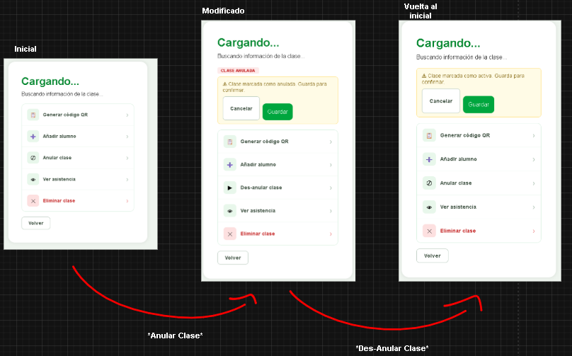
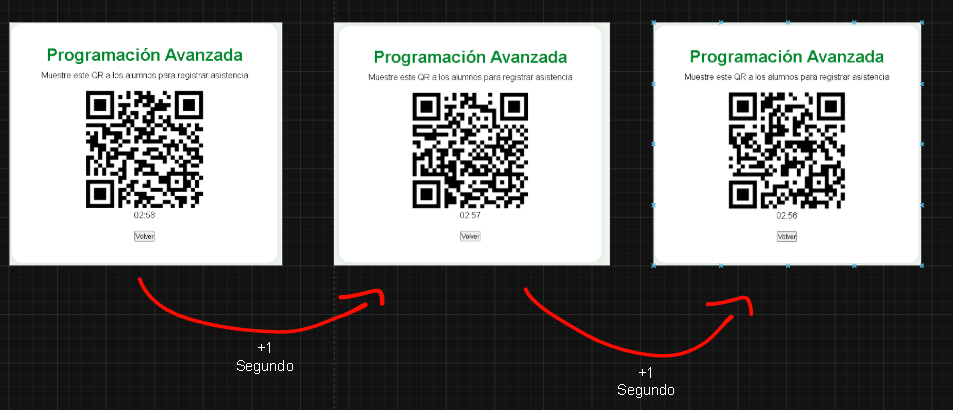
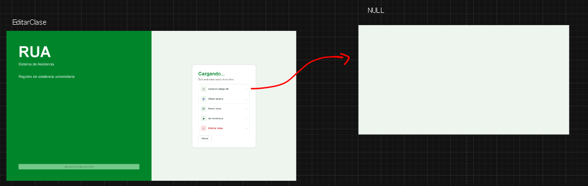
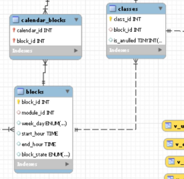
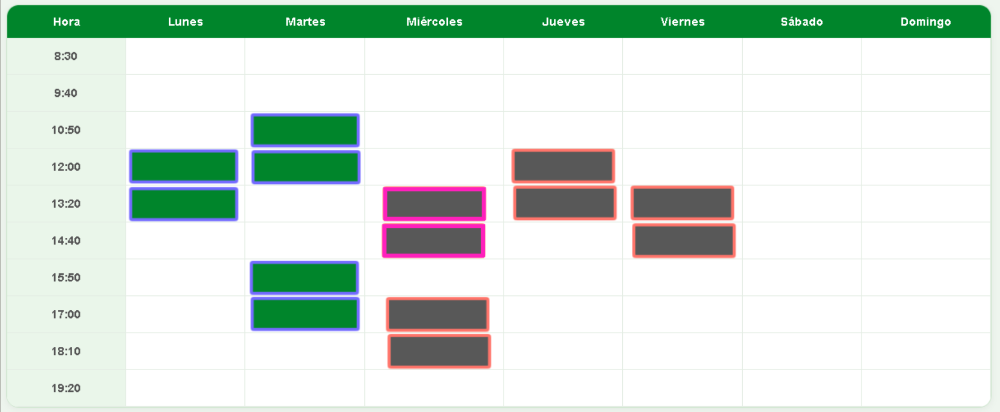
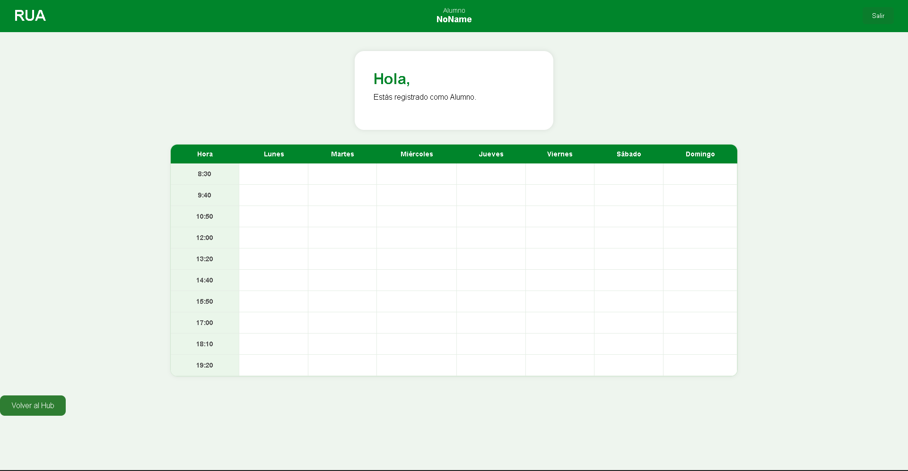
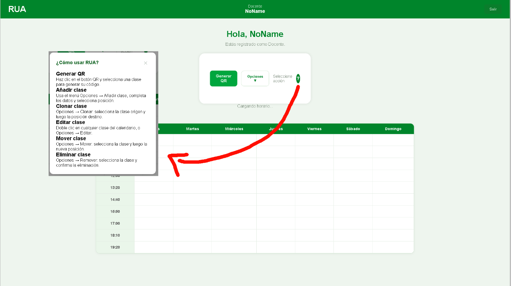

# --- A CONSIDERAR ---

## Variables globales
---

El archivo `config.js` centraliza las variables de configuración global utilizadas para definir las direcciones base de comunicación entre el **Frontend** y el **Backend**.

Actualmente contiene las siguientes variables:

`config.js`

```jsx
export const FRONTEND_URL = "http://localhost:1427";
export const BACKEND_URL = "http://localhost:1428";
```

Estas variables deben utilizarse como punto de entrada para construir las rutas de navegación y comunicación del sistema.

### Uso de `FRONTEND_URL`

La variable `FRONTEND_URL` debe utilizarse cada vez que se requiera realizar una navegación hacia una sección del **Frontend**.

La ruta final debe construirse concatenando la URL base con la ruta relativa de la página correspondiente.

Ejemplo:

```jsx
FRONTEND_URL + "/calendar"
```

Esto permite que, si en el futuro cambia la dirección donde se encuentra desplegado el Frontend, solamente sea necesario modificar esta variable y no cada una de las rutas utilizadas en el proyecto.

### Uso de `BACKEND_URL`

La variable `BACKEND_URL` debe utilizarse para cualquier comunicación con el **Backend**, como:

- Enviar información mediante solicitudes HTTP (`POST`, `PUT`, etc.).
- Solicitar información mediante consultas (`GET`).
- Actualizar o eliminar información almacenada en la base de datos.

Ejemplo:

```jsx
BACKEND_URL + "/calendar/classes"
```

Toda solicitud realizada hacia el Backend debe utilizar esta variable como base de la URL.

## Servicio de comunicación con el Backend
---

Actualmente existe el archivo `apiService.js`, cuya responsabilidad es centralizar todas las llamadas HTTP realizadas hacia el Backend.

Este archivo funciona como una capa intermedia entre los componentes React y la API desarrollada en Spring Boot.

Por lo tanto:

- Los componentes visuales (`components`, `pages`, etc.) no deberían realizar solicitudes HTTP directamente.
- Toda lógica relacionada con enviar, recibir o modificar información mediante el Backend debe implementarse dentro de `apiService.js`.

Ejemplo de flujo recomendado:

```
Componente React
        |
        ↓
apiService.js
        |
        ↓
Backend Spring Boot
        |
        ↓
Base de datos MySQL
```

De esta forma, se mantiene separada la lógica de interfaz de usuario y la lógica de comunicación con el servidor, facilitando la mantención y futuras modificaciones del proyecto.

# --- EJERCICIOS ---

## Ejercicio 1: Guardado y cancelado con error de lógica
---

Dentro del componente `EditarClase.jsx` existe un error en la gestión del estado asociado a los cambios realizados en una clase.

Actualmente, al utilizar las opciones:

- **"Anular clase"**
- **"Des-Anular clase"**

el sistema continúa mostrando el mensaje indicando que existen cambios pendientes de guardar o cancelar, aunque la información de la clase haya vuelto exactamente a su estado inicial.



Esto indica que la lógica encargada de detectar modificaciones no está considerando correctamente estos cambios de estado, provocando que el Frontend interprete que la clase fue modificada cuando realmente no existen diferencias respecto a los datos originales.

## Objetivo

Corregir la lógica de comparación de estados dentro de `EditarClase.jsx`, asegurando que:

- Si el usuario realiza cambios reales sobre la clase, se muestre la opción de guardar o cancelar.
- Si el usuario revierte todos los cambios al estado inicial, el sistema deje de considerar la clase como modificada.
- Las acciones **"Anular clase"** y **"Des-Anular clase"** actualicen correctamente el estado interno del componente.

La solución debe enfocarse en la gestión del estado del componente, evitando agregar lógica innecesaria en otros archivos.

## Ejercicio 2: URL incorrecta
---

En el archivo `apiService.js`, el método:

```js
addStudentToClassById(classId, email) {
    return apiClient.post(`/api/classes/${classId}/students`, { email });
}
```

contiene errores en la definición de la solicitud hacia el Backend.

### Problemas

- La URL utilizada es incorrecta. Actualmente apunta a:

```text
/api/classes/{classId}/students
```

Debe utilizar:

```text
/api/attendace/manual
```

- `classId` no debe enviarse como `PathVariable`, sino como parámetro de la solicitud junto con:

```text
email
classId
status
```

En este orden.
### Consideración

Este cambio afectará a `EditarClase.jsx`, específicamente en `handleSave()`.

Al agregar un estudiante manualmente desde esta vista, el parámetro:

```text
status
```

debe enviarse siempre como:

```text
PRESENT
```

ya que la acción representa que el docente está registrando la asistencia del estudiante.

### Objetivo

Corregir el servicio `addStudentToClassById()` y verificar que los cambios no generen errores en los componentes que dependen de este método.

## Ejercicio 3: QR se genera cada segundo (BUG)
---

Actualmente, el componente `GeneradorQr.jsx` presenta un error en la generación del código QR.

El comportamiento esperado es que se genere **un único QR** y este permanezca activo durante el tiempo definido.

Sin embargo, actualmente se está generando un nuevo QR cada segundo, provocando una regeneración innecesaria del componente y un comportamiento incorrecto del sistema.



### Objetivo

Identificar la causa de la regeneración constante del QR y corregir la lógica implementada en `GeneradorQr.jsx`, asegurando que:

- El QR se genere únicamente cuando corresponda.
- El temporizador no provoque una nueva generación en cada actualización.
- El ciclo de vida del componente gestione correctamente la creación y expiración del QR.

## Ejercicio 4: Generar código QR lleva a una URL incorrecta
---

En `EditarClase.jsx`, la opción **"Generar código QR"** actualmente redirige a una ruta incorrecta, impidiendo acceder al componente encargado de generar el código QR.



### Objetivo

Corregir la lógica del botón **"Generar código QR"** para que:
- Redirija correctamente a la ruta:

```text
/generadorqr
```

- Envíe el ID de la clase mediante `state` durante la navegación.

Este ID será utilizado posteriormente por `GeneradorQR.jsx` para identificar la clase asociada y generar el código QR correspondiente.
## Ejercicio 5: QR debe recibir información del Backend para el UUID
---

Actualmente, en `GeneradorQR.jsx`, el contenido del código QR se genera utilizando una UUID aleatoria creada directamente en el Frontend:

```js
const generateQrValue = useCallback(() => crypto.randomUUID(), []);
```

Este comportamiento es incorrecto, ya que la generación del UUID debe ser responsabilidad del Backend. Esto es debido a que la información asociada al token generado debe almacenarse en la base de datos para permitir validaciones posteriores.

Para realizar este flujo, el Frontend debe enviar al Backend la clase asociada al código QR que se desea generar.

### Objetivo

Implementar la comunicación con el Backend para generar correctamente el QR:

- Realizar una petición **POST** al endpoint:

```text
/api/qr/generate
```

- Enviar como `query parameter` el ID de la clase:

```text
classId
```

- Gestionar la respuesta del Backend:    
    - `OK`: recibir el UUID generado por el Backend y utilizarlo como contenido del QR.
    - `Bad Request`: manejar correctamente el error recibido.

Para mantener la estructura actual del proyecto, se recomienda agregar el método correspondiente dentro de `qrApi()` en `apiService.js`:

```js
export const qrApi = {
    scanQr(token) {
        return apiClient.post("/scanqr", { token });
    },

    // Nuevo método
};
```

## Ejercicio 6: Construccion y Escaneo de QR de usuario
---
Si resolvimos el ejercicio anterior, el QR actualmente deberia de estar generando una ``UUID`` creada por el Backend (La cual internamente dentro de la base de datos esta asociado a una clase en especifico), de manera que un usuario al escanear el QR, unicamente necesite de esta ``UUID``.

Sin embargo, actualmente en el archivo `QrAttempt`: Cuando un usuario escanea el QR asociado dentro de la aplicacion, no pasa absolutamente nada. Esto debido a que aun no se ha aplicado la logica necesaria para lograr que el escaneo se haga de manera exitosa.

La aplicacion React debe permitir marcar asistencia leyendo este QR, sin necesidad que el usuario llegue a salir de la aplicacion.

**Objetivo:** Generar una peticion al Backend con las siguientes indicaciones:
- Peticion de tipo **POST** a ``/api/qr/decode``
- Enviar como ``query parameter``:
	- El `UUID` del QR como "``content``"
	- El ``ID`` del usuario que escaneo el QR como "``userId``"
- Gestionar la respuesta:
	- ``Ok``: Indicandole al usuario que se ha marcado su asistencia de manera exitosa.
	- ``BAD REQUEST``: Indicandole al usuario que hubo un error al marcar su asistencia.

La parte positiva de este ejercicio, es que la mitad de este ya esta hecho...!

Y es que actualmente dentro de ``apiService.js``, hay una funcion con el siguiente contenido

```js
export const qrApi = {
  scanQr(token) {
    return apiClient.post("/scanqr", { token }); 
  },
};
```

La cual, esta enviando unicamente el token `UUID` a una URL erronea, por lo que unicamente necesitas de corregir esta funcion con los detalles ya especificados, y adaptarla a ``QrAttempt.jsx``

## Ejercicio 7: Cargar bloques en AlumnoHorario
---
Actualmente, cuando un docente accede a `/docentehorario`, el sistema obtiene desde el Backend los bloques correspondientes a la semana actual y posteriormente los renderiza en la interfaz.

Sin embargo, este mismo comportamiento no está funcionando en `/alumnohorario`, a pesar de que ambos componentes tienen una lógica similar.

### Objetivo
Adaptar `AlumnoHorario.jsx` para que cargue correctamente los bloques correspondientes al horario del alumno.

Este ejercicio ya cuenta con parte de la implementación necesaria, debido a que `apiService.js` ya posee el método encargado de obtener los bloques:

```jsx
export const calendarApi = {
    getBlocks(calendarId) {
        return apiClient.get(`/api/calendars/${calendarId}/blocks`);
    },
};
```

La solución consiste en reutilizar esta función, siguiendo la misma lógica aplicada en `DocenteHorario.jsx`, pero adaptándola al contexto del alumno.

## Ejercicio 8: Renderizar estado de las clases de la semana actual

---

**Nota:** Para este ejercicio, la asistencia del alumno a una clase es irrelevante.

Antes de continuar, es importante diferenciar dos conceptos:
- Los `blocks` dentro de la base de datos representan únicamente una posición dentro del calendario (día y hora).
- Las `classes` representan una instancia específica de una clase dentro del año académico.

En otras palabras, los `blocks` indican **cuándo y dónde ocurre una clase**, mientras que las `classes` almacenan información propia de esa instancia.

Por ejemplo, si una clase es anulada, esta información se almacena únicamente en la `class` correspondiente y no en el `block` asociado. Mas o menos como se construyo en la base de datos:



Actualmente, gran parte de esta lógica es gestionada por el Backend. Sin embargo, el Frontend también debe representar visualmente el estado actual de cada clase.

Una clase puede encontrarse en los siguientes estados:

- Anulada o activa.
- Ya realizada.
- En desarrollo.
- Por realizarse.

Por ejemplo, como referencia en la siguiente imagen, el estado temporal de la clase, se utilizará el borde visual de cada bloque:

- Azul: la clase ya ocurrió.
- Morado: la clase se está desarrollando actualmente.
- Naranja: la clase aún no comienza.



### Objetivo

Implementar la carga y renderizado del estado actual de las clases mediante los siguientes pasos:

- Realizar una petición **GET** al endpoint:

```text
/api/calendars/actualClasses
```

- Enviar como `Request Param` el ID del calendario:

```text
calendarId
```

- Gestionar la respuesta entregada por el Backend.
- Renderizar correctamente el estado de cada clase dentro del horario del alumno.

### Información entregada por el Backend

El Backend retorna un objeto con una estructura similar a:

```json
{
  "currentWeek": 27,
  "classInfoDTOs": [
    {
      "classId": 101,
      "blockId": 5,
      "isAnulled": 0,
      "timeState": "PAST"
    }
  ]
}
```

El atributo `currentWeek` indica la semana actual del año académico.

Este valor debe almacenarse en la sesión actual, ya que será utilizado posteriormente por otros ejercicios.

La lista `classInfoDTOs` contiene la información necesaria para actualizar visualmente cada bloque:

- `classId`: identificador de la clase.
- `blockId`: bloque del calendario asociado.
- `isAnulled`: indica si la clase fue anulada.
- `timeState`: indica el estado temporal de la clase (`PAST`, `PRESENT`, `FUTURE`).

El diseño visual y los colores utilizados para representar estos estados quedan a elección del desarrollador.
## Ejercicio 9: Movimiento y renderización de clases entre distintas semanas
---
Actualmente, dentro de `AlumnoHorario.jsx`, únicamente se están procesando y mostrando los bloques correspondientes a la semana actual.



Sin embargo, después de implementar el ejercicio anterior, ahora se cuenta con el `weekId` almacenado en la sesión actual, por lo que también debe ser posible consultar y renderizar las clases correspondientes a cualquier semana seleccionada.

## Objetivo

Implementar la navegación entre semanas y la carga dinámica de sus respectivas clases.

Para esto se debe:

- Realizar una petición **GET** al endpoint:

```text
/api/calendars/currentClasses
```

- Enviar los siguientes `Request Param` en este orden:

```text
weekId
calendarId
```

- Recibir y procesar la información entregada por el Backend.
- Actualizar la interfaz mostrando las clases correspondientes a la semana seleccionada.

### Consideraciones

Cada vez que el usuario avance o retroceda manualmente una semana, el valor de `weekId` debe actualizarse correctamente para mantener el control de la semana actualmente visualizada.

La respuesta del Backend tendrá una estructura similar al ejercicio anterior:

```json
{
  "CurrentCalendarClassesDTO": [
    {
      "classId": 101,
      "blockId": 5,
      "isAnulled": 0,
      "timeState": "PAST"
    }
  ]
}
```

La diferencia principal es que esta respuesta no incluye el atributo `weekId`.

Además, para semanas diferentes a la actual, el estado temporal de las clases debe procesarse de la siguiente forma:

- *Si una clase no tiene `timeState = "PAST"`, debe considerarse como `"PAST"`*.

Esto se debe a que las semanas anteriores o futuras no deben representar estados temporales en tiempo real.


## Ejercicio 10: Mini tutoriales para cada página
---
Actualmente, la aplicación cuenta con un sistema de tutorial únicamente en la página **Docente Horario**, permitiendo orientar al usuario sobre las funciones disponibles.



## Objetivo

Extender esta funcionalidad a las páginas principales de la aplicación, implementando un mini tutorial contextual para cada sección importante.

De ser posible, la integración debe realizarse desde la `NavBar`, permitiendo reutilizar el componente y evitar duplicar lógica en cada archivo `.jsx`.

## Recomendación

Para mantener una estructura más ordenada, se recomienda almacenar los textos de los tutoriales en un archivo JSON.

Ejemplo:
```json
{
  "docenteHorario": {
    "title": "Horario docente",
    "description": "Aquí puedes gestionar tus clases..."
  },
  "alumnoHorario": {
    "title": "Horario alumno",
    "description": "Aquí puedes visualizar tus clases..."
  }
}
```

De esta forma, cada página únicamente debe indicar qué sección del JSON utilizar, evitando repetir contenido y facilitando futuras modificaciones.